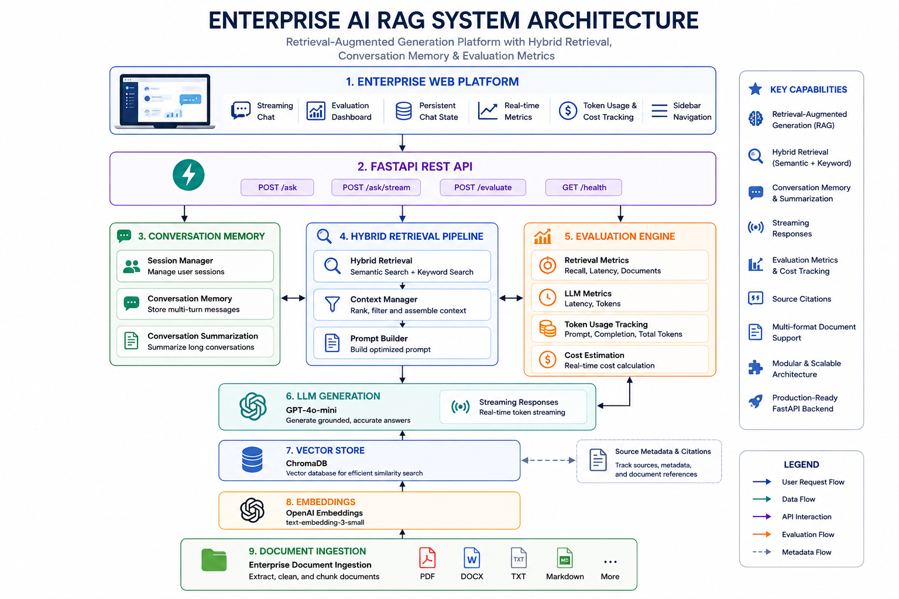
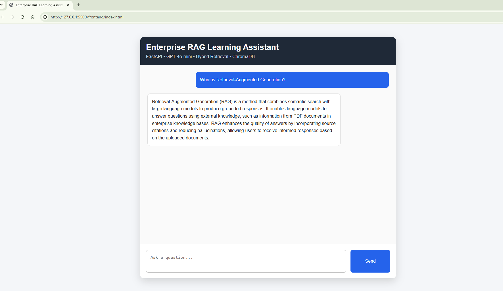
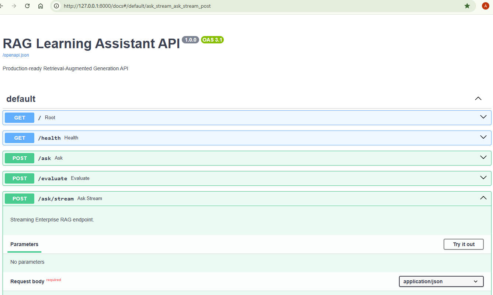

# RAG Learning Assistant

Production-grade Retrieval-Augmented Generation (RAG) application built with FastAPI, OpenAI Embeddings, ChromaDB, and GPT-4o-mini.

This project demonstrates how modern AI systems combine semantic search, vector databases, and large language models to deliver grounded and context-aware answers from custom knowledge sources.

Designed as an enterprise-style AI Engineering project for scalable educational and knowledge retrieval applications.

## System Architecture



## Web Chat Interface

The project also includes a browser-based chat interface for interacting with the Enterprise RAG system.




## Project Status

**Current Version:** v1.6

### Completed

-  FastAPI REST API
-  Retrieval-Augmented Generation (RAG)
-  OpenAI Embeddings
-  ChromaDB Vector Database
-  Multi-document Ingestion
-  Source Metadata & Citations
-  Enterprise Folder Loader
-  TXT Support
-  PDF Support
-  DOCX Support
-  Markdown Support
- Hybrid Search
- Keyword Search
- Context Management
- Prompt Engineering
- GPT-4o-mini Answer Generation
- End-to-End Enterprise RAG Pipeline

### Next Milestones

- Conversation Memory
- Streaming Responses
- Retrieval Evaluation
- Docker Deployment
- CI/CD
- Cloud Deployment


## Overview

Traditional Large Language Models generate responses based only on their training data.

Retrieval-Augmented Generation (RAG) enhances LLMs by retrieving relevant information from external documents before generating a response.

This project allows users to:

* Upload documents
* Convert documents into embeddings
* Store embeddings in ChromaDB
* Perform semantic search
* Retrieve relevant context
* Generate grounded answers using GPT-4o-mini

The result is a more accurate and reliable AI assistant that can answer questions based on specific knowledge sources.


```text
                 Documents
        (TXT • PDF • DOCX • MD)
                     │
                     ▼
          Enterprise Folder Loader
                     │
                     ▼
              Text Extraction
                     │
                     ▼
             Automatic Chunking
                     │
                     ▼
           OpenAI Embeddings
                     │
                     ▼
              ChromaDB Vector Store
                     │
                     ▼
         Hybrid Search (Semantic + Keyword)
                     │
                     ▼
              Context Manager
                     │
                     ▼
               Prompt Builder
                     │
                     ▼
                GPT-4o-mini
                     │
                     ▼
             Grounded Response
```


## Features

### Core RAG Capabilities

-  Retrieval-Augmented Generation (RAG)
-  GPT-4o-mini Integration
-  OpenAI Embeddings
-  ChromaDB Vector Database

### Retrieval Pipeline

-  Semantic Search
-  Keyword Search
-  Hybrid Retrieval (Semantic + Keyword)
-  Intelligent Context Management
-  Prompt Engineering

### Document Processing

-  Multi-format Document Ingestion
  - TXT
  - PDF
  - DOCX
  - Markdown
-  Document Chunking Pipeline
-  Metadata & Source Tracking

### Architecture

-  FastAPI REST API
-  Modular Enterprise Architecture
-  Configurable Environment Variables
-  End-to-End Enterprise RAG Pipeline
-  Local Vector Storage

### AI Pipeline

-  Hybrid Retrieval
-  Context Window Management
-  Prompt Engineering
-  GPT-4o-mini Response Generation
-  Grounded Answer Generation


## Technology Stack

### Backend

- Python 3.14
- FastAPI
- Uvicorn

### AI

- OpenAI API
- GPT-4o-mini
- text-embedding-3-small

### Vector Database

- ChromaDB

### Document Processing

- TXT
- PDF (pypdf)
- DOCX (python-docx)
- Markdown (markdown + BeautifulSoup)

### Development

- Git
- GitHub
- VS Code


## Supported Document Types

| Document Type | Supported |
|--------------|-----------|
| TXT | ✅ |
| PDF | ✅ |
| DOCX | ✅ |
| Markdown | ✅ |


## Project Structure

```text
RAG-Learning-Assistant/
│
├── app/
│   ├── api/
│   ├── config/
│   ├── core/
│   ├── embeddings/
│   ├── ingestion/
│   ├── llm/
│   ├── models/
│   ├── retrieval/
│   └── services/
│
├── assets/
├── data/
├── scripts/
│
├── main.py
├── requirements.txt
└── README.md
```


## Installation

Clone the repository:

git clone https://github.com/aramradif/RAG-Learning-Assistant.git

Navigate into the project:

cd RAG-Learning-Assistant

Create a virtual environment:

python -m venv .venv

Activate:

Windows:

.venv\Scripts\activate

Install dependencies:

pip install -r requirements.txt


## Running the API

## API Documentation

The application includes interactive Swagger UI documentation.



Start FastAPI:

uvicorn main:app --reload

Open Swagger UI:

http://127.0.0.1:8000/docs


## Example Request

POST /ask

Request:

{
"question": "What is RAG?"
}

Response:

{
"answer": "RAG combines semantic search with large language models to provide grounded answers based on external documents."
}


## Roadmap

### Phase 1 — Enterprise Retrieval 

- FastAPI Backend
- ChromaDB Integration
- Multi-format Document Ingestion
- Semantic Search
- Keyword Search
- Hybrid Retrieval
- Context Management
- Prompt Engineering

### Phase 2 — GPT Integration 

- GPT-4o-mini Integration
- End-to-End Enterprise RAG Pipeline

### Phase 3 — Conversation Memory

- Multi-turn Conversations
- Session Memory
- Chat History

### Phase 4 — Streaming Responses

- Token Streaming
- Real-time Response Generation

### Phase 5 — Evaluation

- Retrieval Metrics
- Hallucination Evaluation
- Latency Benchmarking

### Phase 6 — Containerization

- Docker
- Docker Compose

### Phase 7 — Cloud Deployment

- Azure
- AWS
- CI/CD Pipeline

### Phase 8 — Agentic AI

- Tool Calling
- Multi-Agent Orchestration
- Workflow Automation


