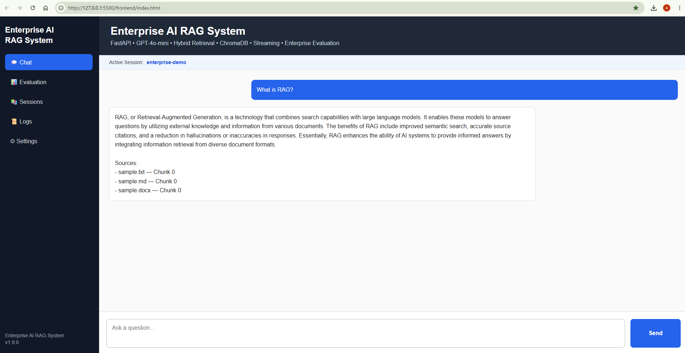
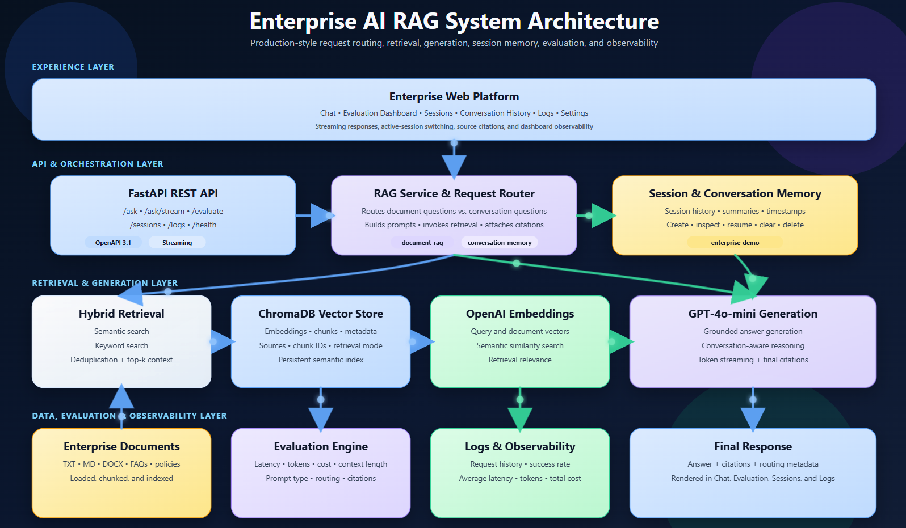
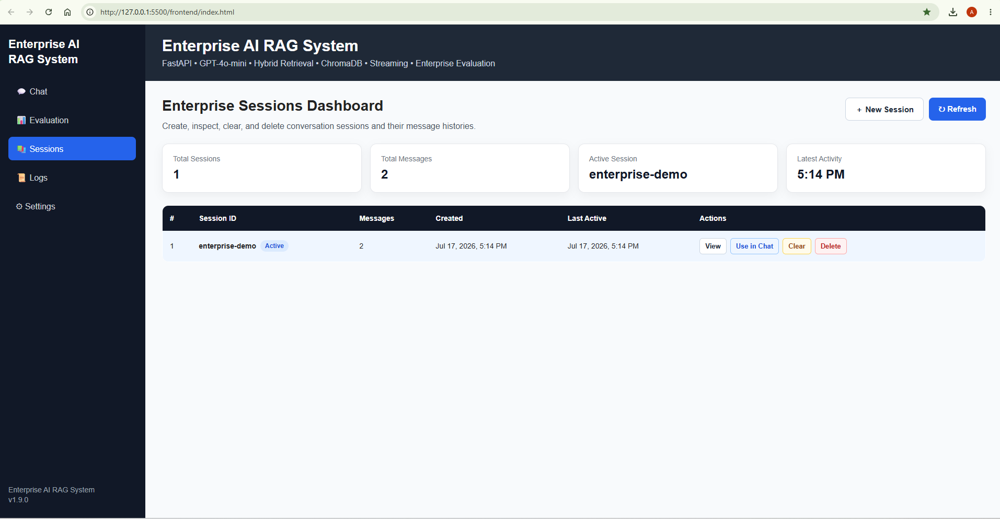
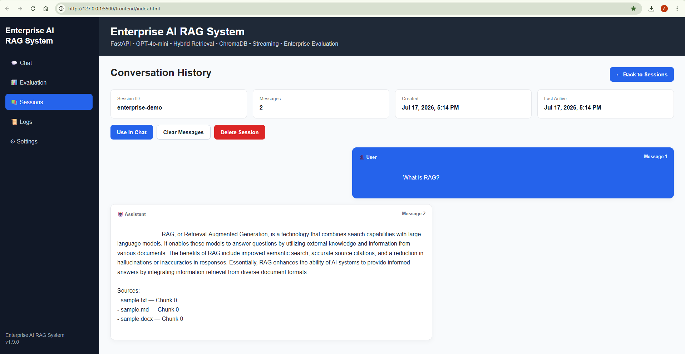
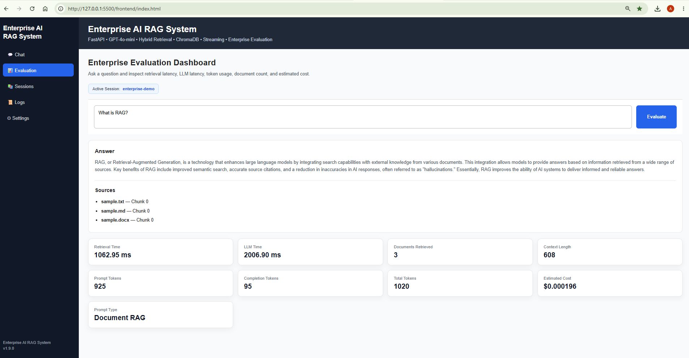
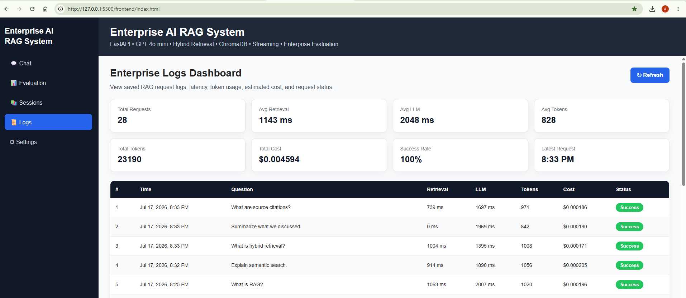
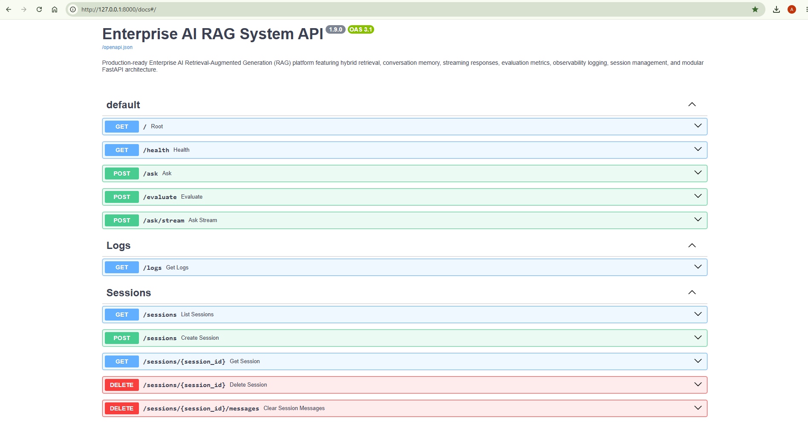

# Enterprise AI RAG System

A production-oriented **Retrieval-Augmented Generation (RAG)** platform built with **FastAPI**, **OpenAI GPT-4o-mini**, **OpenAI Embeddings**, and **ChromaDB**.

The project demonstrates how modern enterprise AI systems combine **hybrid retrieval**, **vector search**, **conversation memory**, **streaming responses**, and **evaluation metrics** to deliver grounded, context-aware answers from custom knowledge bases.

Unlike a simple chatbot, this project is being developed as a complete **Enterprise AI Platform**, with an extensible architecture that will continue to evolve through observability, authentication, CI/CD, cloud deployment, and agentic AI capabilities.



---

# Quick Start

```bash
git clone https://github.com/aramradif/Enterprise-AI-RAG-System.git

cd Enterprise-AI-RAG-System

python -m venv .venv

# Windows
.venv\Scripts\activate

pip install -r requirements.txt

uvicorn main:app --reload
```

Open:

- Swagger UI → http://127.0.0.1:8000/docs
- Enterprise Platform → http://127.0.0.1:5500/frontend/index.html

---

# Table of Contents

- Overview
- System Architecture
- Enterprise Web Platform
- Key Features
- Technology Stack
- Project Structure
- Installation
- Running the Backend API
- API Endpoints
- Roadmap

---

# Overview

Traditional Large Language Models generate responses using only the knowledge contained in their training data.

Retrieval-Augmented Generation (RAG) improves answer quality by retrieving relevant information from external documents before generating a response.

This project allows users to:

- Ingest enterprise documents
- Generate embeddings
- Store vectors in ChromaDB
- Perform hybrid retrieval
- Maintain conversation memory
- Stream AI responses
- Evaluate retrieval and generation performance
- Generate grounded answers using GPT-4o-mini

---

# Enterprise Highlights

This project demonstrates the architecture and engineering practices commonly found in modern enterprise AI applications.

### AI & Retrieval

- Retrieval-Augmented Generation (RAG)
- Hybrid Retrieval (Semantic + Keyword Search)
- OpenAI GPT-4o-mini
- OpenAI Embeddings
- ChromaDB Vector Database
- Grounded AI Responses with Source Citations

### Conversation Intelligence

- Session-Based Conversation Memory
- Conversation Summaries
- Multi-turn Conversations
- Intelligent Request Routing
- Streaming Responses

### Enterprise Platform

- Interactive Chat Interface
- Sessions Dashboard
- Conversation History
- Evaluation Dashboard
- Logs Dashboard
- Swagger API Documentation

### AI Observability

- Retrieval Latency
- LLM Latency
- Prompt Type Detection
- Token Usage
- Estimated Cost
- Request Logging
- Enterprise Metrics Dashboard


# System Architecture



The Enterprise AI RAG System follows a layered architecture that separates the user interface, API orchestration, retrieval pipeline, large language model, conversation memory, and observability components.

A request flows through the FastAPI API into the RAG Service, where the system determines whether document retrieval is required or whether conversation memory can answer the request directly.

For document questions, Hybrid Retrieval combines semantic vector search and keyword search to retrieve the most relevant document chunks from ChromaDB. These results are used to build a grounded prompt for GPT-4o-mini.

Every request is evaluated and logged, producing latency, token usage, estimated cost, routing information, and source citations that power the Evaluation and Logs dashboards.

---

# Enterprise Web Platform

The project includes an enterprise-style web platform that communicates directly with the FastAPI backend.

Current capabilities include:

- Streaming AI Chat
- Enterprise Evaluation Dashboard
- Persistent Chat State
- Hybrid Retrieval
- Conversation Memory
- Real-Time Evaluation Metrics
- Token Usage Tracking
- Estimated Cost Reporting
- Sidebar Navigation

The platform is designed to evolve into a complete Enterprise AI workspace featuring observability, authentication, administrative tooling, and cloud deployment.

## Streaming Chat


---

## Sessions Dashboard

Manage and switch between conversation sessions.



---

## Conversation History

Review previous conversations and maintain long-term context.



---

## Evaluation Dashboard

Monitor retrieval latency, LLM performance, token usage, routing decisions, citations, and estimated cost.



---

## Logs Dashboard

Track request history, observability metrics, latency, token consumption, and cost across the system.



---

# Project Status

**Current Version:** v1.9

## Latest Release (v1.9)

### New Features

- Enterprise Session Management
- Conversation History Dashboard
- Enterprise Evaluation Dashboard
- Enterprise Logs Dashboard
- Intelligent Request Routing
- Source Citations
- Prompt Type Detection
- Streaming AI Responses
- Hybrid Retrieval (Semantic + Keyword)
- Conversation Memory
- Session Lifecycle API
- Enterprise Observability

### Improvements

- Professional Enterprise UI
- Enhanced Evaluation Metrics
- Token & Cost Tracking
- Improved API Documentation
- Better Dashboard Layout
- Cleaner Session Management
- Modernized Architecture

---

# Key Features

## AI & Retrieval

- Retrieval-Augmented Generation (RAG)
- GPT-4o-mini Integration
- OpenAI Embeddings
- Hybrid Retrieval (Semantic + Keyword)
- Intelligent Context Management
- Prompt Engineering
- Grounded AI Responses

---

## Knowledge Base

- ChromaDB Vector Database
- Enterprise Folder Loader
- Multi-format Document Ingestion
- Automatic Chunking
- Source Metadata & Citations

Supported document types:

- PDF
- DOCX
- TXT
- Markdown

---

## Conversation Intelligence

- Session-Based Memory
- Enterprise Conversation Memory
- Conversation Summaries
- Multi-turn Conversations
- Streaming Responses

---

## Enterprise Web Platform

- Enterprise Dashboard
- Interactive Streaming Chat
- Evaluation Dashboard
- Persistent Chat State
- Sidebar Navigation

---

## AI Evaluation

- Retrieval Latency
- LLM Latency
- Token Usage
- Prompt Tokens
- Completion Tokens
- Total Tokens
- Estimated Cost Tracking
- Documents Retrieved

---

## Backend

- FastAPI REST API
- Modular Enterprise Architecture
- Configurable Environment Variables
- End-to-End Enterprise AI Pipeline

---

# Technology Stack

## Backend

- Python 3.14
- FastAPI
- Uvicorn

## Artificial Intelligence

- OpenAI GPT-4o-mini
- text-embedding-3-small
- Retrieval-Augmented Generation (RAG)
- Prompt Engineering

## Vector Database

- ChromaDB

## Document Processing

- PDF (pypdf)
- DOCX (python-docx)
- TXT
- Markdown

## Frontend

- HTML
- CSS
- JavaScript (ES Modules)

## Development

- Git
- GitHub
- VS Code

---

# Project Structure

```text
Enterprise-AI-RAG-System/
│
├── app/
│   ├── api/
│   ├── config/
│   ├── core/
│   ├── embeddings/
│   ├── evaluation/
│   ├── ingestion/
│   ├── llm/
│   ├── memory/
│   ├── models/
│   ├── retrieval/
│   └── services/
│
├── assets/
├── data/
├── frontend/
│   ├── js/
│   └── pages/
│
├── scripts/
├── tests/
│
├── main.py
├── requirements.txt
└── README.md
```

---

# Installation

Clone the repository:

```bash
git clone https://github.com/aramradif/Enterprise-AI-RAG-System.git
```

Navigate into the project:

```bash
cd Enterprise-AI-RAG-System
```

Create a virtual environment:

```bash
python -m venv .venv
```

Activate it:

### Windows

```bash
.venv\Scripts\activate
```

Install dependencies:

```bash
pip install -r requirements.txt
```

---

# Running the Backend API

Start the FastAPI server:

```bash
uvicorn main:app --reload
```

Open Swagger UI:

```
http://127.0.0.1:8000/docs
```



---

# API Endpoints

The Enterprise AI RAG System exposes a REST API for chat, streaming, evaluation, session management, and observability.

| Method | Endpoint | Description |
|----------|----------|-------------|
| GET | `/` | API information |
| GET | `/health` | Health check |
| POST | `/ask` | Standard RAG question answering |
| POST | `/ask/stream` | Streaming AI responses |
| POST | `/evaluate` | Enterprise evaluation with metrics |
| GET | `/logs` | Request logs and observability metrics |
| GET | `/sessions` | List all conversation sessions |
| POST | `/sessions` | Create a new session |
| GET | `/sessions/{session_id}` | Retrieve a session and its conversation history |
| DELETE | `/sessions/{session_id}` | Delete a session |
| DELETE | `/sessions/{session_id}/messages` | Clear all messages in a session |

---

# Enterprise Web Platform

Launch the frontend using VS Code Live Server.

Open:

```
http://127.0.0.1:5500/frontend/index.html
```

The frontend currently supports:

- Streaming Chat
- Conversation Memory
- Enterprise Evaluation Dashboard
- Real-Time AI Metrics
- Persistent Chat State

---

# Roadmap

The Enterprise AI RAG System is being developed incrementally with a focus on production-ready AI engineering practices.

##  Completed

### Enterprise Retrieval

- Hybrid Retrieval (Semantic + Keyword)
- ChromaDB Vector Database
- OpenAI Embeddings
- Multi-format Document Ingestion
- Automatic Chunking

### Intelligent Generation

- GPT-4o-mini Integration
- Grounded AI Responses
- Source Citations
- Streaming Responses

### Conversation Intelligence

- Session Management
- Conversation Memory
- Conversation Summaries
- Conversation History

### Enterprise Platform

- Interactive Chat
- Sessions Dashboard
- Evaluation Dashboard
- Logs Dashboard
- Swagger API
- Enterprise Navigation

### AI Observability

- Retrieval Metrics
- LLM Metrics
- Prompt Type Detection
- Token Usage
- Cost Estimation
- Request Logging

---

##  In Progress

- Docker
- Docker Compose
- CI/CD Pipeline
- Unit & Integration Testing

---

##  Future Enhancements

- Authentication & Authorization
- Redis Caching
- PostgreSQL Persistence
- Cloud Deployment (Azure / AWS)
- Kubernetes
- Monitoring with Prometheus & Grafana
- MCP Integration
- Multi-Agent Workflows
- Enterprise Security

---

# Project Goals

This project was built to demonstrate how modern enterprise AI systems can be designed using Retrieval-Augmented Generation (RAG), large language models, vector databases, conversation memory, streaming APIs, and enterprise observability.

The long-term vision is to evolve this platform into a production-ready enterprise AI assistant with cloud deployment, authentication, scalable infrastructure, agentic AI workflows, and advanced monitoring capabilities.

---

# License

This project is licensed under the MIT License.