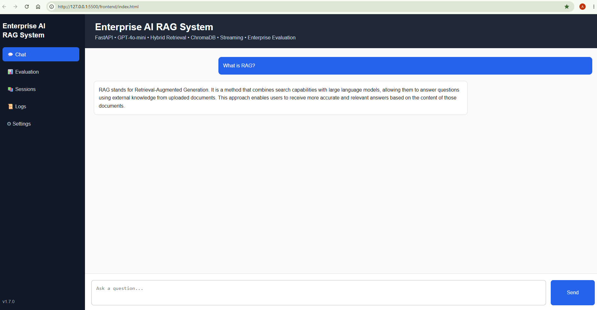

# Enterprise-AI-RAG-System

Production-grade Retrieval-Augmented Generation (RAG) application built with FastAPI, OpenAI Embeddings, ChromaDB, and GPT-4o-mini.

This project demonstrates how modern AI systems combine semantic search, vector databases, and large language models to deliver grounded and context-aware answers from custom knowledge sources.

Designed as an enterprise-style AI Engineering project for scalable educational and knowledge retrieval applications.

## Quick Start

1. Clone the repository
2. Install dependencies
3. Configure your `.env`
4. Start the FastAPI server
5. Launch the Enterprise Web Platform

## Table of Contents

- Overview
- System Architecture
- Web Chat Interface
- Project Status
- Current Capabilities
- Features
- Technology Stack
- Project Structure
- Installation
- Running the API
- Web Chat Interface
- Roadmap

## System Architecture


## Enterprise Web Platform

The project includes an enterprise-style web platform that provides an interactive interface for communicating with the FastAPI backend.

Current capabilities include:

- Streaming AI chat
- Enterprise Evaluation Dashboard
- Persistent chat state
- Sidebar navigation
- Hybrid Retrieval
- Real-time evaluation metrics
- Token usage and estimated cost reporting

The platform is designed to evolve into a complete Enterprise AI workspace with session management, observability, authentication, and administrative capabilities.




## Project Status

**Current Version:** v1.6

### Completed

-  FastAPI REST API
-  Retrieval-Augmented Generation (RAG)
-  OpenAI Embeddings
-  ChromaDB Vector Database
-  Multi-format Document Ingestion
-  Source Metadata & Citations
-  Enterprise Folder Loader
-  Hybrid Retrieval (Semantic + Keyword)
-  Intelligent Context Management
-  Prompt Engineering
-  GPT-4o-mini Integration
-  End-to-End Enterprise RAG Pipeline
-  Enterprise Conversation Memory
-  Session-Based Chat Memory
-  Conversation Summarization
-  Streaming API
-  Interactive Web Chat Interface
-  TXT Support
-  PDF Support
-  DOCX Support
-  Markdown Support

### Next Milestones

- Retrieval Evaluation
- Authentication & Authorization
- Docker Deployment
- CI/CD Pipeline
- Cloud Deployment (AWS / Azure)
- Agentic AI & Multi-Agent Orchestration


## Overview

Traditional Large Language Models generate responses based only on their training data.

Retrieval-Augmented Generation (RAG) enhances LLMs by retrieving relevant information from external documents before generating a response.

This project allows users to:

* Upload documents
* Convert documents into embeddings
* Store embeddings in ChromaDB
* Perform semantic search
* Retrieve relevant context
* Generate grounded answers using GPT-4o-mini

The result is a more accurate and reliable AI assistant that can answer questions based on specific knowledge sources.


## Enterprise Design Principles

- Modular Architecture
- Separation of Concerns
- Configurable Components
- Streaming API Support
- Hybrid Retrieval
- Conversation Memory
- Production-Oriented Folder Structure


## Current Capabilities

The Enterprise RAG Learning Assistant currently supports:

- Enterprise Retrieval-Augmented Generation (RAG)
- Hybrid Retrieval (Semantic + Keyword Search)
- GPT-4o-mini Grounded Answer Generation
- Conversation Memory
- Session-Based Chat
- Conversation Summarization
- Streaming Responses
- Browser-Based Chat Interface
- FastAPI REST API
- Multi-format Document Ingestion


```text
                 Documents
        (TXT • PDF • DOCX • MD)
                     │
                     ▼
          Enterprise Folder Loader
                     │
                     ▼
              Text Extraction
                     │
                     ▼
             Automatic Chunking
                     │
                     ▼
           OpenAI Embeddings
                     │
                     ▼
              ChromaDB Vector Store
                     │
                     ▼
         Hybrid Search (Semantic + Keyword)
                     │
                     ▼
              Context Manager
                     │
                     ▼
               Prompt Builder
                     │
                     ▼
                GPT-4o-mini
                     │
                     ▼
             Grounded Response
```


## Features

### Core RAG Capabilities

-  Retrieval-Augmented Generation (RAG)
-  GPT-4o-mini Integration
-  OpenAI Embeddings
-  ChromaDB Vector Database

### Retrieval Pipeline

-  Semantic Search
-  Keyword Search
-  Hybrid Retrieval (Semantic + Keyword)
-  Intelligent Context Management
-  Prompt Engineering

### Document Processing

-  Multi-format Document Ingestion
  - TXT
  - PDF
  - DOCX
  - Markdown
-  Document Chunking Pipeline
-  Metadata & Source Tracking

### Architecture

-  FastAPI REST API
-  Modular Enterprise Architecture
-  Configurable Environment Variables
-  End-to-End Enterprise RAG Pipeline
-  Local Vector Storage

### AI Pipeline

-  Hybrid Retrieval
-  Context Window Management
-  Prompt Engineering
-  GPT-4o-mini Response Generation
-  Grounded Answer Generation


### Enterprise Chat

- Interactive Web Chat Interface
- Streaming Responses
- Conversation Memory
- Session-Based Memory
- Conversation Summarization


## Technology Stack

### Backend

- Python 3.14
- FastAPI
- Uvicorn

### AI

- OpenAI GPT-4o-mini
- text-embedding-3-small
- Prompt Engineering
- Retrieval-Augmented Generation (RAG)

### Vector Database

- ChromaDB

### Document Processing

- TXT
- PDF (pypdf)
- DOCX (python-docx)
- Markdown (markdown + BeautifulSoup)

### Development

- Git
- GitHub
- VS Code


## Supported Document Types

| Document Type | Supported |
|--------------|-----------|
| TXT | ✅ |
| PDF | ✅ |
| DOCX | ✅ |
| Markdown | ✅ |


## Project Structure

RAG-Learning-Assistant/
│
├── app/
│   ├── api/
│   ├── config/
│   ├── core/
│   ├── embeddings/
│   ├── ingestion/
│   ├── llm/
│   ├── memory/
│   ├── models/
│   ├── retrieval/
│   └── services/
│
├── assets/
├── data/
├── frontend/
├── scripts/
├── tests/
│
├── main.py
├── requirements.txt
└── README.md


## Installation

Clone the repository:

```bash
git clone https://github.com/aramradif/Enterprise-AI-RAG-System.git
```

Navigate into the project:

cd RAG-Learning-Assistant

Create a virtual environment:

python -m venv .venv

Activate:

Windows:

.venv\Scripts\activate

Install dependencies:

pip install -r requirements.txt


## Running the Backend API

## API Documentation

The application includes interactive Swagger UI documentation.


Start FastAPI:

uvicorn main:app --reload

Open Swagger UI:

http://127.0.0.1:8000/docs

## Example Request

POST /ask

Request:

{
"question": "What is RAG?"
}

Response:

{
"answer": "RAG combines semantic search with large language models to provide grounded answers based on external documents."
}

## Streaming Endpoint

POST /ask/stream

Returns:

```
text/plain (StreamingResponse)
```

Streams GPT responses incrementally for real-time user interaction.


## Using the Enterprise Web Platform

The project also includes an interactive browser-based chat interface.

Start Live Server (VS Code extension), then open:

```
http://127.0.0.1:5500/frontend/index.html
```

The frontend communicates directly with the FastAPI Enterprise RAG backend and supports:

- Conversation Memory
- Streaming Responses
- Multi-turn Chat
- Enterprise RAG Pipeline


## Roadmap

### Phase 1 — Enterprise Retrieval 

-  FastAPI Backend
-  ChromaDB Integration
-  Multi-format Document Ingestion
-  Semantic Search
-  Keyword Search
-  Hybrid Retrieval
-  Context Management
-  Prompt Engineering

### Phase 2 — GPT Integration 

-  GPT-4o-mini Integration
-  End-to-End Enterprise RAG Pipeline

### Phase 3 — Conversation Memory 

-  Multi-turn Conversations
-  Session Memory
-  Chat History
-  Conversation Summarization

### Phase 4 — Streaming Responses 

-  Streaming API
-  Browser Streaming Interface

### Phase 5 — Evaluation

- Retrieval Metrics
- Hallucination Evaluation
- Latency Benchmarking

### Phase 6 — Security & Deployment

- Authentication & Authorization
- Docker
- Docker Compose
- CI/CD Pipeline

### Phase 7 — Cloud Deployment

- Azure
- AWS
- Production Infrastructure

### Phase 8 — Agentic AI

- Tool Calling
- Multi-Agent Orchestration
- Workflow Automation
- MCP Integration


